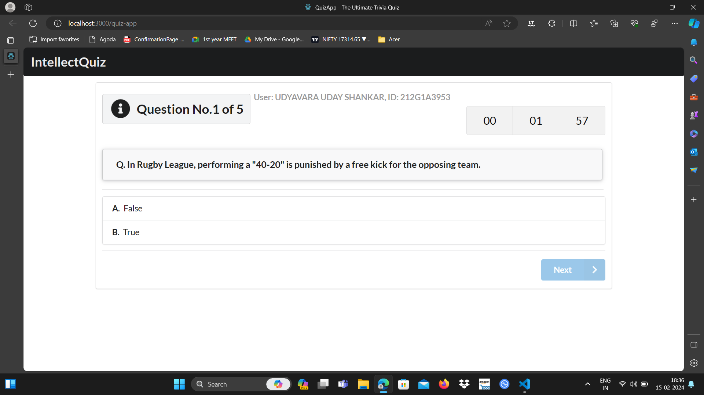

<h1 align="center">
  <a href="">
    QuizApp
  </a>
</h1>


<p align="center">
  QuizApp is a free and open-source quiz application that lets you play fully customized quizzes right in the browser.
</p>


## Built with

- [React](http://react.dev)
- [Semantic UI](https://semantic-ui.com)
- [Open Trivia Database API](https://opentdb.com/api_config.php)

## Live App
[Live Demo](https://udayshankar3953.github.io/INTELLECT-QUIZ/)


## Development

To get a local copy of the code, clone it using git:

```
git clone 
cd quiz-app
```

Install dependencies:

```
npm install
```

Now, you can start a local web server by running:

```
npm start
```

And then open http://localhost:3000 to view it in the browser.

#### Available Scripts

In this project, you can run the following scripts:

| Script        | Description                                                             |
| ------------- | ----------------------------------------------------------------------- |
| npm start     | Runs the app in the development mode.                                   |
| npm test      | Launches the test runner in the interactive watch mode.                 |
| npm run build | Builds the app for production to the `build` folder.                    |
| npm run eject | This command will remove the single build dependency from your project. |

## Screenshots


*Main page*


*Quiz page MCQ*

*Quiz page True or False*


*Results page*

*Response sheet*
